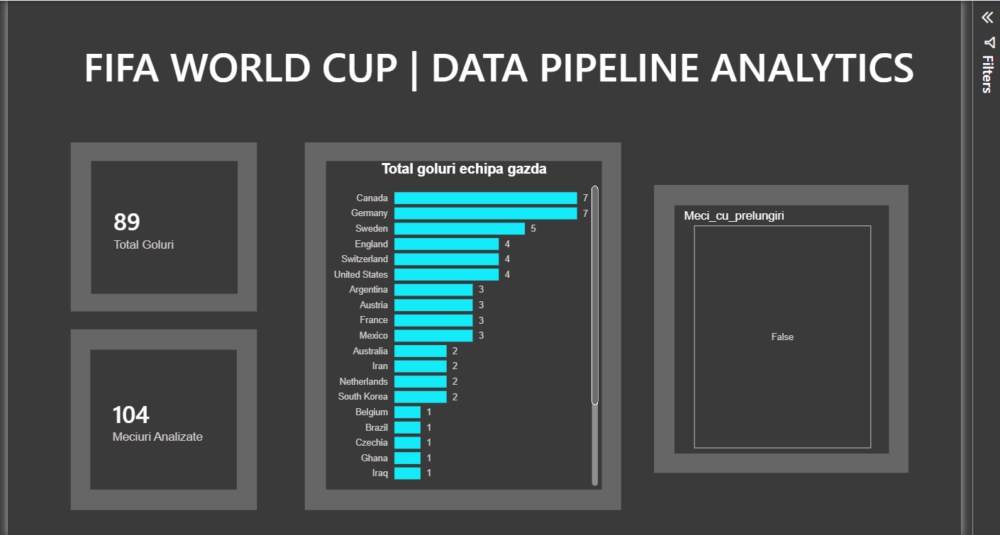

# World Cup 2026 End-to-End Data Engineering & BI Pipeline

An end-to-end Data Engineering project that simulates a production-ready hybrid ETL pipeline. The system extracts World Cup match data from a REST API, processes and cleans it using Python, loads it into a PostgreSQL relational database, and visualizes key performance metrics via a premium Power BI Dashboard.

---

## Dashboard Preview


---

## Architecture & Tech Stack
* **Language:** Python 3.x
* **Data Manipulation:** Pandas
* **Database & ORM:** PostgreSQL / SQLAlchemy
* **Visualization:** Power BI Desktop (Dark Mode, Containerized Layout)
* **Environment & Security:** `python-dotenv` for isolating API credentials

---

## ETL Flow & Data Pipeline

### 1. Extract
* Designed to connect to a commercial football REST API (`football-data.org`) to fetch raw match schedules and results in JSON format.
* **Hybrid/Mock Implementation:** Since live Cup data is locked behind premium API tiers, the pipeline includes a fully-tested fallback mechanism that loads local raw JSON snapshots from the `data_raw/` directory, ensuring seamless offline execution.

### 2. Transform (Feature Engineering)
* Cleans data types and standardizes naming conventions using **Pandas**.
* Computes business metrics such as **Attack Efficiency** (`eficienta_atac`), which tracks team goals scored.
* Implements dynamic conditional logic to flag tight knockout matches that went into extra time or penalties (`meci_cu_prelungiri`).

### 3. Load
* Connects securely to a local **PostgreSQL** database using `SQLAlchemy`.
* Automates database connection pooling and executes efficient data loading into relational schemas.

---

## Database Schema & Analytical Queries
Once loaded, the data is structured to allow deep SQL analysis. Example queries:

### 1. Top 5 most spectacular matches (by number of goals)
```sql
SELECT 
    echipa_gazda, 
    echipa_oaspete, 
    faza_competitie, 
    eficienta_atac AS total_goluri
FROM 
    meciuri_world_cup
ORDER BY 
    eficienta_atac DESC
LIMIT 5;

``` 
### 2. Avarage goals scored by competition phase
```sql
SELECT  
    faza_competitie,
    COUNT(*) AS numar_meciuri,
    ROUND(AVG(eficienta_atac), 2) AS medie_goluri_pe_meci
FROM 
    meciuri_world_cup
GROUP BY 
    faza_competitie
ORDER BY 
    medie_goluri_pe_meci DESC;
```
### 3. Home teams that scored above the overall tournament average
```sql
SELECT 
    echipa_gazda,
    SUM(goluri_gazda) AS total_goluri_acasa,
    COUNT(*) AS meciuri_jucate_acasa
FROM 
    meciuri_world_cup
GROUP BY 
    echipa_gazda
HAVING 
    AVG(goluri_gazda) > (SELECT AVG(goluri_gazda) FROM meciuri_world_cup)
ORDER BY 
    total_goluri_acasa DESC;
```

---

## Power BI Business Insights & Analytics

The interactive dashboard transforms raw match data into actionable sports analytics, focusing on team performance, tournament dynamics, and match intensity:

* **Top Performing Teams & Attack Efficiency:** Evaluates which countries dominated the tournament by aggregating goals scored (`eficienta_atac`) per match. This highlights the most explosive offenses and teams with the highest tactical consistency.
* **Match Intensity & Extra-Time Analytics:** Uses conditional logic fields (`meci_cu_prelungiri`) to isolate high-pressure games. This allows analysts to filter and analyze knockout stage drama, tracking how many games required overtimes or penalty shootouts.
* **Home vs. Away Performance Matrix:** Compares team statistics based on their stadium designation (`echipa_gazda` vs. `echipa_oaspeti`), revealing structural patterns in scoring trends and tournament advantages.
* **Dynamic Tournament Slicers:** Features advanced filtering components that let users instantly slice data by specific teams or match types, turning static relational database rows into an intuitive discovery tool.

---

## How to Run the Project Locally

1. **Clone the repository:**
```bash
   git clone [https://github.com/tomarobert-tech/world.cup-etl-pipeline.git](https://github.com/tomarobert-tech/world.cup-etl-pipeline.git)
   cd world.cup-etl-pipeline
```
2. **Install dependencies:**
```bash
   pip install -r requirements.txt
```
3. **Configure your Database:**
* Create a .env file in the root folder with your PostgreSQL credentials:
   DB_USER=your_user
   DB_PASSWORD=your_password
   DB_HOST=localhost
   DB_PORT=5432
   DB_NAME=your_db_name

4. **Execute the pipeline:**
```bash
   python main.py
``` 